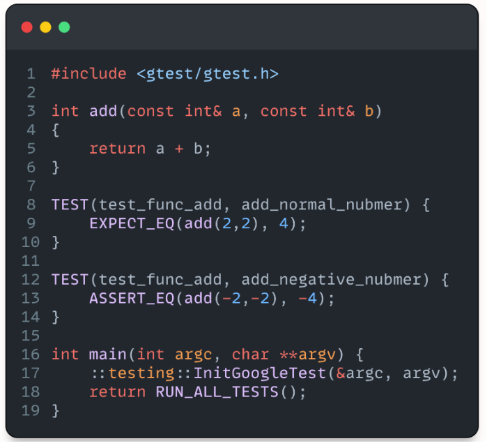
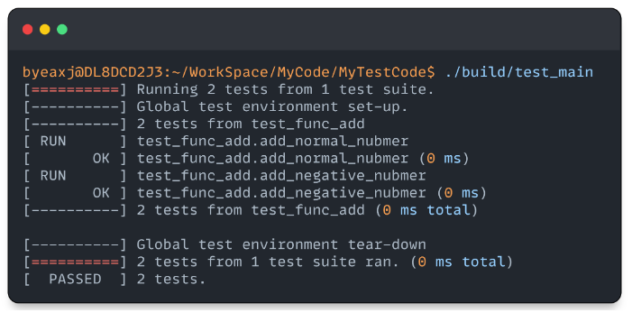
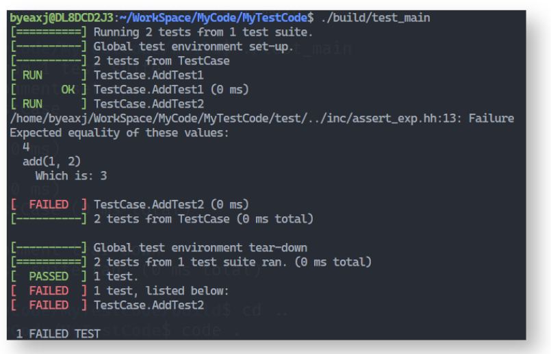
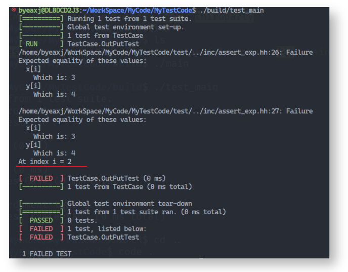
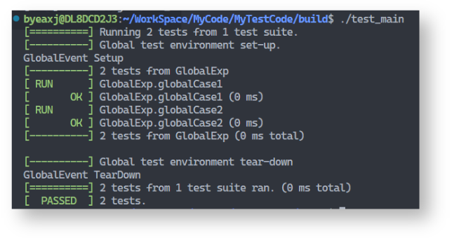
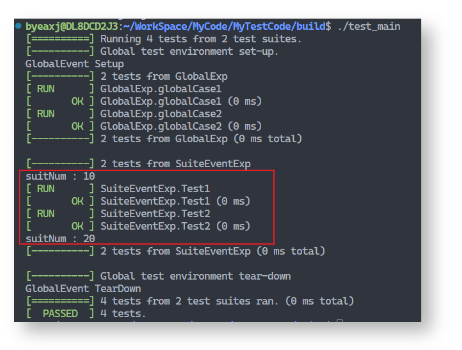
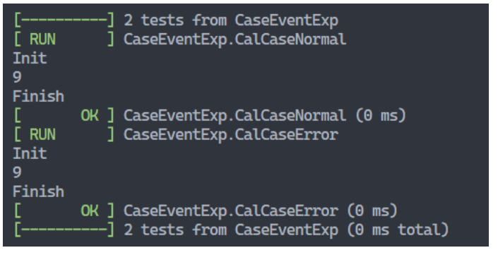
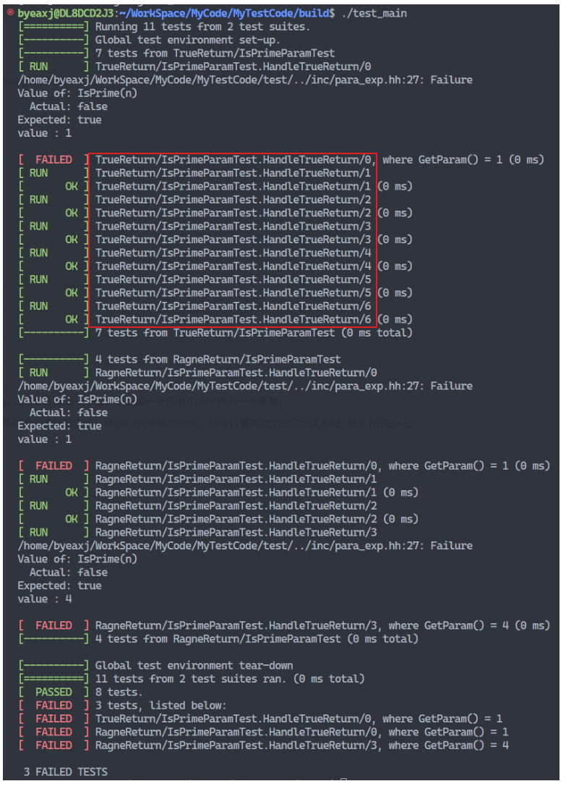
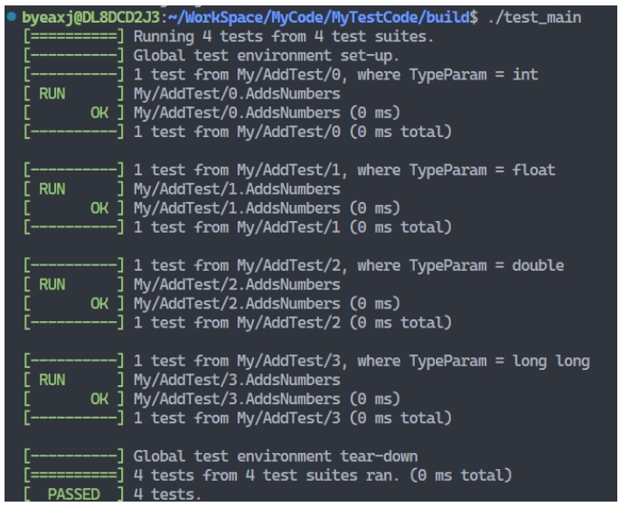

# google test 学习

[TOC]


## Usage

### CMake
`CMake version >= 3.13`

### Platform
`Ubuntu >= 18.04`

### Compile & Run
```bash
cmake -Bbuild
cmake --build build
cd build
./test_main
```
or
```bash
chmod 777 CompileAndRun.sh
./CompileAndRun.sh
```

## Learning Notes

### 介绍

gtest是一个跨平台的(Liunx、Mac OS X、Windows、Cygwin、Windows CE and Symbian)C++单元测试框架，由google公司发布。gtest是为在不同平台上为编写C++测试而生成的。它提供了丰富的断言、致命和非致命判断、参数化、”死亡测试”等等。


### 使用

首先用一个简单的例子看一下gtest的基本用法





#### 基本组成

可以看到一个测试程序由以下部分组成

1.  待测试函数
2.  测试case
3.  初始化函数
4.  执行函数


**TEST(test_func_add, add_normal_nubmer)  :** 表示 [TestSuites，TestCase] 用中文来讲就是 [测试套件， 测试用例], 在其内部编写该用例的测试内容

**EXPECT_EQ**、**ASSERT_EQ** 属于Google包装的一系列EXPECT_*和ASSERT_*宏， 其区别在于

- **EXPECT_\* 执行失败时，会继续按顺序执行 TEST 内的其他用例**
- **ASSERT_\* 执行失败时，会结束当前的 TEST**

**testing::InitGoogleTest(&argc, argv)：** 通过接收命令行参数进行一些初始化操作

**RUN_ALL_TESTS():** 运行所有的 测试案例


### 断言

gtest 使用一系列断言的宏来检查值是否符合预期，主要分为两类：ASSERT 和 EXPECT

- ASSERT 不通过的时候会认为是一个 fatal 的错误，退出当前函数（只是函数）。
- EXPECT 失败的话会继续运行当前函数，对于函数内几个失败可以同时报告出来。

通常用 EXPECT 级别的断言就好，除非当前检查点失败后函数的后续检查没有意义。

```cpp
int add(int a, int b)
{
  return a + b;
}
// 预期值与实际值相同
TEST(TestCase, AddTest1)
{
  EXPECT_EQ(3, add(1, 2));
}
// 预期值与实际值不同
TEST(TestCase, AddTest2)
{
  EXPECT_EQ(4, add(1, 2));
}
```

以上是对加法进行测试， 分别预期 add(1, 2) 的值为 3 和 4， 

结果如下， 会自动输出错误相关的详细信息



#### 断言自定义信息输出

断言只会主动打印期待值和实际值

如果需要在出错后打印一些自己需要的信息， 可以用 << 操作符进行输出

示例如下

```CPP
TEST(TestCase, OutPutTest)
{
    int x[5] = {1,2,3,4,5};
    int y[5] = {1,2,4,4,5};
 
    for (int i = 0; i < 5; ++i)
    {
        EXPECT_EQ(x[i], y[i]);
        EXPECT_EQ(x[i], y[i]) << "At index i = " << i;
    }
}
```

结果如下，可以定制化使用需要的信息，使输出更加有用，容易理解



#### 常用断言

#####  条件判断

| Fatal assertion          | Nonfatal assertion       | Verifies           |
| :----------------------- | :----------------------- | :----------------- |
| ASSERT_TRUE(condition);  | EXPECT_TRUE(condition);  | condition is true  |
| ASSERT_FALSE(condition); | EXPECT_FALSE(condition); | condition is false |


##### 数值比较

| Fatal assertion        | Nonfatal assertion     | Verifies     |
| :--------------------- | :--------------------- | :----------- |
| ASSERT_EQ(val1, val2); | EXPECT_EQ(val1, val2); | val1 == val2 |
| ASSERT_NE(val1, val2); | EXPECT_NE(val1, val2); | val1 != val2 |
| ASSERT_LT(val1, val2); | EXPECT_LT(val1, val2); | val1 < val2  |
| ASSERT_LE(val1, val2); | EXPECT_LE(val1, val2); | val1 <= val2 |
| ASSERT_GT(val1, val2); | EXPECT_GT(val1, val2); | val1 > val2  |
| ASSERT_GE(val1, val2); | EXPECT_GE(val1, val2); | val1 >= val2 |

##### 字符串比较

| Fatal assertion               | Nonfatal assertion            | Verifies                                                |
| :---------------------------- | :---------------------------- | :------------------------------------------------------ |
| ASSERT_STREQ(str1, str2);     | EXPECT_STREQ(str1, str2);     | the two C strings have the same content                 |
| ASSERT_STRNE(str1, str2);     | EXPECT_STRNE(str1, str2);     | the two C strings have different content                |
| ASSERT_STRCASEEQ(str1, str2); | EXPECT_STRCASEEQ(str1, str2); | the two C strings have the same content, ignoring case  |
| ASSERT_STRCASENE(str1, str2); | EXPECT_STRCASENE(str1, str2); | the two C strings have different content, ignoring case |

##### 显示成功失败

| **Fatal assertion** | **Nonfatal assertion** |
| :------------------ | :--------------------- |
| FAIL();             | ADD_FAILURE();         |
| SUCCEED();          |                        |

```c++
TEST(ExplicitTest, Demo)
{
    ADD_FAILURE() << "Sorry"; // None Fatal Asserton，继续往下执行。
 
    //FAIL(); // Fatal Assertion，不往下执行该案例。
 
    SUCCEED();
}
```

##### 异常检查

| Fatal assertion                          | Nonfatal assertion                       | Verifies                                        |
| :--------------------------------------- | :--------------------------------------- | :---------------------------------------------- |
| ASSERT_THROW(statement, exception_type); | EXPECT_THROW(statement, exception_type); | statement throws an exception of the given type |
| ASSERT_ANY_THROW(statement);             | EXPECT_ANY_THROW(statement);             | statement throws an exception of any type       |
| ASSERT_NO_THROW(statement);              | EXPECT_NO_THROW(statement);              | statement doesn't throw any exception           |

```c++
int Foo(int a, int b)
{
    if (a == 0 || b == 0)
    {
        throw "don't do that";
    }
    int c = a % b;
    if (c == 0)
        return b;
    return Foo(b, c);
}
 
TEST(FooTest, HandleZeroInput)
{
    EXPECT_ANY_THROW(Foo(10, 0));
    EXPECT_THROW(Foo(0, 5), char*);
}
```

### 事件

gtest 提供了三种事件机制，实现测试用例不同级别的数据共享

- 全局事件， 在所有case执行前和执行后触发
- TestSuite事件， 在某个 测试套件的 执行前后触发
- TestCase事件， 在每个测试用例执行前后触发


#### 全局事件

使用全局事件，必须定义一个工具类继承gtest的 testing::Environment类，需要用到 这个类中的 SetUp() 和 TearDown() 方法

SetUp() 函数会在所有用例执行前触发一次

TearDown() 函数会在所有用例执行结束后触发一次

需要在 main 函数中使用 testing::AddGlobalTestEnvironment 注册该工具类


示例代码如下

```c++
class GlobalEventExp : public testing::Environment
{
public:
    GlobalEventExp() = default;
    ~GlobalEventExp() = default;
 
    virtual void SetUp()
    {
        std::cout << "GlobalEvent Setup" << std::endl;
    }
 
    virtual void TearDown()
    {
        std::cout << "GlobalEvent TearDown" << std::endl;
    }
 
};
 
TEST(GlobalExp, globalCase1)
{
    EXPECT_TRUE(true);
}
 
TEST(GlobalExp, globalCase2)
{
    EXPECT_TRUE(true);
}
 
int main(int argc, char **argv) {
    testing::AddGlobalTestEnvironment(new GlobalEventExp);   // 需要注册该类到全局测试环境中
    ::testing::InitGoogleTest(&argc, argv);
    return RUN_ALL_TESTS();
}
```

运行如下, 在case1 执行前运行了 setup, 在 case2 结束后执行了 teatdown



#### TestSuite事件

gtest为提供了保证每个测试套件内部变量共享，套件之间独立的方法。

通过使用静态变量，存储套件中每个实例会用到的数据，减少反复初始化和申请内存的开销

测试宏需要使用 TEST_F 而不是 TEST


继承 testing::Test 类，然后实现两个静态方法

- SetUpTestCase() 在一个 testSuite 开始前执行
- TearDownTestCase() 在 一个 testSuite 结束后执行

示例代码如下

```c++
class SuiteEventExp : public testing::Test {
 protected:
  static void SetUpTestCase() {
        std::cout << "suitNum : " << suitNum << std::endl;
  }
  static void TearDownTestCase() {
        std::cout << "suitNum : " << suitNum << std::endl;
  }
  static int suitNum;
};
 
int SuiteEventExp::suitNum = 10;    // 初始化为 10
 
TEST_F(SuiteEventExp, Test1)
{
    SuiteEventExp::suitNum += 5;
}
TEST_F(SuiteEventExp, Test2)
{
    SuiteEventExp::suitNum += 5;
}
```

执行结果如下，包含了之前 全局事件， 可以看到 同一个 测试套件内部共享了同一个静态变量



#### TestCase事件

TestCase事件也是继承 testing::Test, 不过需要重写的方法是 SetUp() 和 TearDown() 

示例代码如下

```c++
class cal{
 
public:
    int a = 10;
    void Init(){ std::cout << "Init" << std::endl; }
    void Finish(){ std::cout << "Finish" << std::endl; }
    int Num(){return --a;}
};
 
class CaseEventExp : public testing::Test {
 protected:
  virtual void SetUp() {
        m_cal.Init();
  }
  virtual void TearDown() {
        m_cal.Finish();
  }
 
  cal m_cal;
};
 
TEST_F(CaseEventExp, CalCase1)
{
    std::cout << m_cal.Num() << std::endl;
}
 
TEST_F(CaseEventExp, CalCase2)
{
    std::cout << m_cal.Num() << std::endl;
}
```

执行结果如下, 可以看到 m_cal 在每个 case 中都被重新初始化， 每个 case之间的数据相互独立



### 参数化

#### 数值参数化

在设计测试案例的时候， 需要考虑给被测函数传入不同值的情况， 按之前学习的测试方法，代码可能会这样写

```c++
EXPECT_TRUE(IsPrime(3));
EXPECT_TRUE(IsPrime(5));
EXPECT_TRUE(IsPrime(11));
EXPECT_TRUE(IsPrime(23));
EXPECT_TRUE(IsPrime(17));
```

但是这样写不仅重复性太高，当测试参数太多时，这样的编写测试用例只会效率低下。

所以需要使用 gtest 的参数化方案

需要继承 **testing::TestWithParam<T>,** 测试宏使用 **TEST_P**

示例代码如下

```c++
// 测试代码
bool IsPrime(int n) // 检查 n 是否为质数
{
    if (n <= 1) return false;
    if (n % 2 == 0) return n == 2;
    for (int i = 3; ; i += 2) {
        if (i > n/i) break;
        if (n % i == 0) return false;
    }
    return true;
}
 
class IsPrimeParamTest : public::testing::TestWithParam<int>
{
};
 
TEST_P(IsPrimeParamTest, HandleTrueReturn)
{
    int n =  GetParam();
    EXPECT_TRUE(IsPrime(n)) << "value : " << n;
}
 
INSTANTIATE_TEST_CASE_P(ValueList, IsPrimeParamTest, testing::Values(3, 5, 11, 23, 17));
INSTANTIATE_TEST_CASE_P(RangeList, IsPrimeParamTest, testing::Range(1, 5));
```

解释

自定义一个类来继承 public::testing::TestWithParam<int>， 是为了把 类型 int 传入到 TEST_P 中， 类的内部可以参考 gtest 事件，添加 SetUp TeatDown等事件函数

TEST_P 宏

- 第一个参数需要使用前面的自定义类，
- 第二个参数时用例名称， GetParam() 是 gtest 的内置函数， 可以获取到 INSTANTIATE_TEST_CASE_P 宏中设置的数值列表


INSTANTIATE_TEST_CASE_P 用来设置参数列表

- 第一个参数是测试案例的前缀表示这一系列参数的作用， 
- 第二个参数是 自定义类的名称，需要与 TEST_P 的第一个参数一致， 
- 第三个参数是参数生成器

 关于参数列表， gtest 提供了多种参数生成器
  

| Range(begin, end, [step])                    | 范围在begin~end之间，步长为step，不包括end                   |
| -------------------------------------------- | ------------------------------------------------------------ |
| Values(v1, v2, ..., vN)                      | v1,v2到vN的值                                                |
| ValuesIn(container) and ValuesIn(begin, end) | 从一个C类型的数组或是STL容器，或是迭代器中取值               |
| Bool()                                       | 取false 和 true 两个值                                       |
| Combine(g1, g2, ..., gN)                     | 这个比较强悍，它将g1,g2,...gN进行排列组合，g1,g2,...gN本身是一个参数生成器，每次分别从g1,g2,..gN中各取出一个值，组合成一个元组(Tuple)作为一个参数。说明：这个功能只在提供了<tr1/tuple>头的系统中有效。gtest会自动去判断是否支持tr/tuple，如果你的系统确实支持，而gtest判断错误的话，你可以重新定义宏GTEST_HAS_TR1_TUPLE=1。 |

运行结果如下
参数会按照生成器的设置顺序注入到用例中

使用参数化后的测试案例会以 ***前缀/测试套件名.测试用例名/测试序号*** 的形式对用例重新命名



#### 类型参数化

gtest还提供了应付各种不同类型的数据时的方案，以及参数化类型的方案。


需要使用新的测试宏 TYPED_TEST_P

```c++
// 定义一个简单的函数，用于将两个数相加
template<typename T>
T add(T a, T b) {
    return a + b;
}
 
// 创建一个测试套件
template<typename T>
class AddTest : public testing::Test {
protected:
    T value1;
    T value2;
    T expectedSum;
 
    void SetUp() override {
        // 设置测试数据
        value1 = T{3};
        value2 = T{5};
        expectedSum = T{8};
    }
};
 
// 定义类型参数化的测试套件
TYPED_TEST_SUITE_P(AddTest);
 
// 定义测试用例，参数化类型为整型和浮点型
TYPED_TEST_P(AddTest, AddsNumbers) {
    // 使用测试套件中设置的数据进行测试
    EXPECT_EQ(this->expectedSum, add(this->value1, this->value2));
}
 
// 注册测试用例，并指定要测试的类型
REGISTER_TYPED_TEST_SUITE_P(AddTest, AddsNumbers);
 
// 指定要测试的类型列表
using MyTypes = testing::Types<int, float, double, long long>;
 
// 实例化测试套件
INSTANTIATE_TYPED_TEST_SUITE_P(My, AddTest, MyTypes);
```

运行如下



### 运行参数

使用gtest编写的测试案例通常本身就是一个可执行文件，因此运行起来非常方便。

同时，gtest也为我们提供了一系列的运行参数（环境变量、命令行参数或代码里指定），使得我们可以对案例的执行进行一些有效的控制。

gtest 设置参数的三种途径

- 系统环境变量
- 命令行参数
- 代码中指定 FLAG

优先级为： 命令行参数 > 代码中指定 FLAG > 系统环境变量

示例如下，假如需要 gtest 生成 xml 报告

**命令行参数**， 使用 --gtest_output

```bash
./test_main --gtest_output="xml:"
```

**代码指定 FLAG**， 使用 output,  也就是把命令行参数的–gtest_ 去掉

```c++
int main(int argc, _TCHAR* argv[])
{
    testing::GTEST_FLAG(output) = "xml:";
    testing::InitGoogleTest(&argc, argv);
    return RUN_ALL_TESTS();
}
```

**环境变量** 使用 GTEST_OUTPUT

```bash
export GTEST_OUTPUT=xml
./test_main
```

部分命令行参数如下

| 参数                                    | 描述                                            | 使用例                        |
| :-------------------------------------- | :---------------------------------------------- | :---------------------------- |
| --gtest_filter=pattern                  | 通过模式匹配选择要运行的测试用例                | --gtest_filter=MyTest.*       |
| --gtest_repeat=count                    | 指定测试用例的重复运行次数                      | --gtest_repeat=3              |
| --gtest_shuffle                         | 对测试用例进行随机排序                          | --gtest_shuffle               |
| --gtest_random_seed=seed                | 指定随机数生成器的种子                          | --gtest_random_seed=123       |
| --gtest_break_on_failure                | 在第一个测试失败时停止测试执行                  | --gtest_break_on_failure      |
| --gtest_death_test_style=style          | 指定死亡测试（Death Test）的风格                | --gtest_death_test_style=fast |
| --gtest_color={yes\|no\|auto}           | 控制测试结果的彩色输出                          | --gtest_color=yes             |
| --gtest_output=xml[:path/to/output.xml] | 将测试结果输出为XML格式，并可选指定输出文件路径 | --gtest_output=xml:result.xml |

### 参考

官方仓库地址

https://github.com/google/googletest


官方使用文档

https://google.github.io/googletest/

- [GoogleTest Primer](https://google.github.io/googletest/primer.html) - Teaches you how to write simple tests using GoogleTest. Read this first if you are new to GoogleTest.
- [GoogleTest Advanced](https://google.github.io/googletest/advanced.html) - Read this when you’ve finished the Primer and want to utilize GoogleTest to its full potential.
- [GoogleTest Samples](https://google.github.io/googletest/samples.html) - Describes some GoogleTest samples.
- [GoogleTest FAQ](https://google.github.io/googletest/faq.html) - Have a question? Want some tips? Check here first.


中文介绍

https://www.cnblogs.com/coderzh/archive/2009/04/06/1426755.html
